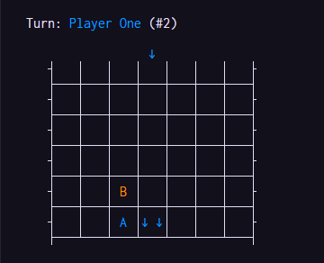

# Go Four

 A simple board game for two players.

 The first player to get four of their pieces in a row wins.

 

 Pieces can be placed in columns, rows, or diagonals to win.

 

 The game can be customized with different names, colors, and board sizes!

  

## Running the game

1. Install [Go](https://go.dev/)

2. Open a terminal in the repo root directory, and run the command:

    ```shell
    go run .
    ```

<!--
360x292 03ff00 ff2f9b
400x224 fff100 5b00ff
-->
